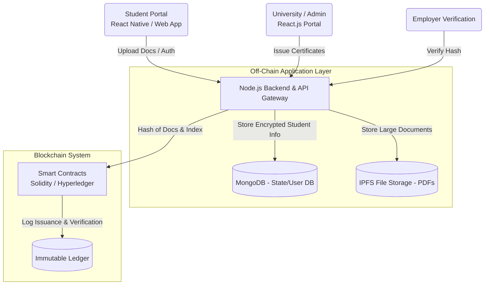

# EduChain Kenya: System Design & Architecture

## 1. System Overview
The EduChain platform provides a secure, decentralized "Blockchain-based Certificate Verification System for Kenyan Universities." This document outlines the structural framework of the system.

## 2. Architecture Diagram (Application Layer vs Blockchain Layer)

## 3. Component Details

### A) Blockchain Layer
- **Smart Contracts:** Implemented in Solidity, storing a registry of verifiable academic certificates.
- **Data Model:** Only cryptographic hashes (SHA-256) of certificates are stored on-chain. This ensures privacy while maintaining data immutability. No PII (Personally Identifiable Information) or plain-text names exist on the ledger.

### B) Off-Chain Storage Layer
- **MongoDB:** Manages dynamic application state, user accounts, JWT credentials, institutional profiles, and temporary metadata.
- **IPFS (InterPlanetary File System):** Used to store the actual PDF certificates or transcripts. The hash generated by IPFS is what effectively acts as the unique identifier signed onto the blockchain.

### C) Backend Application Layer (Node.js/Express)
- Acts as the API gateway between client applications, off-chain storage, and the blockchain layer.
- Components include `student.auth.controller.js` for Identity Management and `data.controller.js` for data routing.

### D) Identity & Security Management
- Custom token-based authentication (JWT).
- Role-Based Access Control (RBAC) separating Student, Admin (University), and Employer actions.

## 4. Key Workflows

### 4.1. Certificate Issuance (University)
1. University admin authenticates to the `admin-client`.
2. Admin uploads a student's final certificate or academic record.
3. The platform computes the cryptographic hash of the document.
4. The backend calls the `CertificateRegistry` smart contract's `issueCertificate()` method.
5. The hash and student index are logged to the blockchain, returning a transaction receipt.

### 4.2. Verification (Employer or Agency)
1. Employer accesses the verification portal.
2. The student's public certificate hash is input into the system.
3. The backend executes `verifyCertificate()` on the smart contract.
4. If valid, the system retrieves the underlying data (if access was granted off-chain) and returns "Verified."

### 4.3. Data Exchange Demo (Institution to Institution)
Institutions can verify a transfer student's previous academic status by executing a read against the shared blockchain state relying on the student's ID (e.g. KCSE Index), allowing for secure Cross-Agency Data Sharing.
